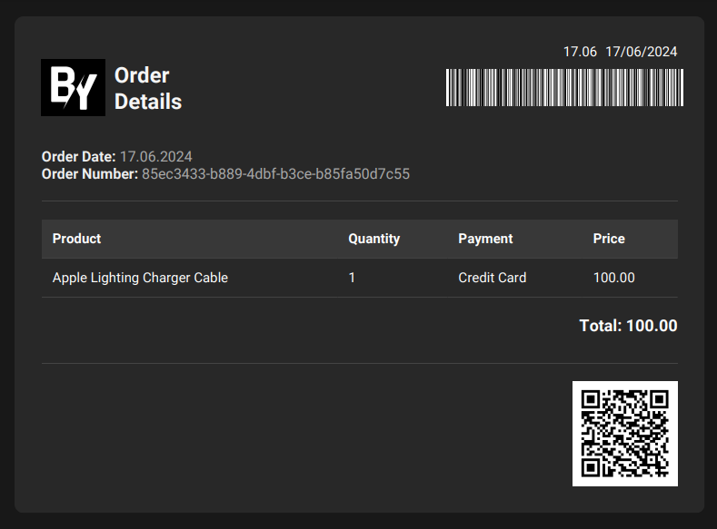

<a name="readme-top"></a>

[![LinkedIn][linkedin-shield]][linkedin-url]

<br />
<div align="center">
<a href="https://github.com/othneildrew/Best-README-Template">
    
  </a>
  <h3 align="center">TOYOTA - 32Bit Backend Project</h3>

  <p align="center">
    A role-controlled application for selling products and generating PDF receipts.
    <br />
    <a href="https://github.com/baranyalcinn/TYT-Project"><strong>Explore the docs »</strong></a>
    <br />
    <br />
    <a href="https://github.com/baranyalcinn/TYT-Project/tree/master">View Demo</a>
    ·
    <a href="https://github.com/baranyalcinn/TYT-Project/issues/new?labels=bug&template=bug-report---.md">Report Bug</a>
    ·
    <a href="https://github.com/baranyalcinn/TYT-Project/issues/new?labels=enhancement&template=feature-request---.md">Request Feature</a>
  </p>
</div>


<!-- TABLE OF CONTENTS -->
<details>
  <summary>Table of Contents</summary>
  <ol>
    <li>
      <a href="#about-the-project">About The Project</a>
      <ul>
        <li><a href="#built-with">Built With</a></li>
      </ul>
    </li>
    <li>
      <a href="#getting-started">Getting Started</a>
      <ul>
        <li><a href="#prerequisites">Prerequisites</a></li>
        <li><a href="#installation">Installation</a></li>
      </ul>
    </li>
    <li><a href="#usage">Usage</a></li>
    <li><a href="#roadmap">Roadmap</a></li>
    <li><a href="#contributing">Contributing</a></li>
    <li><a href="#contact">Contact</a></li>
    <li><a href="#acknowledgments">Acknowledgments</a></li>
  </ol>
</details>

## About The Project

[](sample-slip.PNG)

 This project is a role-controlled application designed for selling products and generating receipts in PDF format. It utilizes a robust architecture built on top of Spring Boot framework and leverages various technologies to ensure efficiency and security.

**Key Features:**

* **Role-based Access Control:** Allows for different user roles with specific permissions for managing products, orders, and receipts.
* **Product Management:** Enables creating, updating, and deleting product information with detailed descriptions and pricing.
* **Order Processing:** Supports placing orders, tracking their status, and generating invoices.
* **PDF Receipt Generation:** Creates professional-looking PDF receipts containing order details and product information.

<p align="right"><a href="#readme-top">⬆️</a></p>

### Built With

* [![Spring-Boot][Spring-Boot.com]][Spring-Boot-url]
* [![Spring-Data][Spring-Data.com]][Spring-Data-url]
* [![Spring-Web][Spring-Web.com]][Spring-Web-url]
* [![JWT][JWT.com]][JWT-url]
* [![JUnit][JUnit.com]][JUnit-url]
* [![Mockito][Mockito.com]][Mockito-url]
* [![Log4j][Log4j.com]][Log4j-url]
* [![PostgreSQL][PostgreSQL.com]][PostgreSQL-url]
* [![Lombok][Lombok.com]][Lombok-url]
* [![Docker][Docker.com]][Docker-url]
* [![Jib][Jib.com]][Jib-url]

<p align="right"><a href="#readme-top">⬆️</a></p>

## Getting Started

### Prerequisites

* JDK 17 or higher
* Maven 3.6.3 or higher
* PostgreSQL 15 or higher
* Docker (optional)

### Installation

1. **Clone the repository:**

   ```bash
   git clone https://github.com/baranyalcinn/TYT-Project.git
   ```

2. **Navigate to the project directory:**

   ```bash
   cd master
   ```
3. **Create Database**
   ```sql
   CREATE DATABASE your_database_name;
   ```

4. **Update Database Configuration**
   Open the `application.yml` or `application-test.yml` file in the `src/main/resources` directory and update the database connection details:
    ```properties
    spring:
      datasource:
        url: jdbc:postgresql://localhost:5432/your_database_name
        username: your_database_user
        password: your_database_password
    ```

5. **Run the application:**

   ```bash
   mvn spring-boot:run
   ```
<p align="right"><a href="#readme-top">⬆️</a></p>

## Usage

This project includes a Postman collection to help you quickly explore and test the API. 

**Getting Started with the Postman Collection:**

1. **Download the Collection:** You can download the `toyota.postman_collection.json` file [here](toyota.postman_collection.json). 

2. **Import into Postman:** 
   * Open your Postman application.
   * Click on **Import**.
   * Select the `toyota.postman_collection.json` file you downloaded.

3. **Start Testing!**  The collection contains pre-configured requests for the API endpoints. You can now send requests and explore the API's functionality. 
### Profiles:
* `dev`: For local development and testing with `application-dev.yml` file.
* `test`: For deployment and testing on a server or other machines with `application-test.yml` file (default for Docker).

<br />

### Exporting Your Database to `readyForProject.sql`

To export your existing PostgreSQL database to the `readyForProject.sql` file, you can use one of the following methods:

**1. Using the `pg_dump` Tool (Command Line):**

   1. Open your terminal and connect to your PostgreSQL server:
      ```bash
      psql -h localhost -p 5432 -U your_username -d your_database_name
      ```
      (Replace `localhost`, `5432`, `your_username`, and `your_database_name` with your actual credentials if needed)
   2. Run the following command:

      ```bash
      pg_dump -h localhost -p 5432 -U your_username -d your_database_name > readyForProject.sql
      ```

   This command will export the schema and data of your `your_database_name` database to a file named `readyForProject.sql`.

**2. Using the pgAdmin Tool (Graphical):**

   1. Open pgAdmin and connect to your PostgreSQL server.
   2. Right-click on the database you want to export.
   3. Select the "Backup" option.
   4. In the "Filename" section, set the filename to `readyForProject.sql`.
   5. In the "General" tab, set the "Format" to "Plain." 
   6. Click the "Backup" button.

**Important Notes:**

* These methods will export your entire database to the `readyForProject.sql` file. 
* The `readyForProject.sql` file may contain sensitive data. Store this file in a secure location. 

<br />

### Docker:
1. **Build the Docker image:**

   ```bash
   mvn compile jib:dockerBuild
   ```

2. **Run the Docker-Compose:**

   ```bash
   docker-compose up --build -d
   ```
   Make sure to expose the port you specified in your application properties.

<p align="right"><a href="#readme-top">⬆️</a></p>

## Roadmap

- [ ] Implement additional features.
- [ ] Enhance API documentation.
- [ ] Improve test coverage.
- [ ] Integrate with other services.

See the [open issues](https://github.com/baranyalcinn/TYT-Project/issues) for a full list of proposed features (and known issues).

<p align="right"><a href="#readme-top">⬆️</a></p>

## Contributing

Contributions are welcome! Please follow these steps:

1. Fork the repository.
2. Create a new branch for your feature.
3. Make your changes and commit them.
4. Push your changes to your fork.
5. Submit a pull request.

<p align="right"><a href="#readme-top">⬆️</a></p>

## Contact

* Baran Yalçın - [@Linkedin](https://www.linkedin.com/in/baran-yalçın-521691242) - brnylcn19@gmail.com

Project Link: [https://github.com/baranyalcinn/TYT-Project/tree/master](https://github.com/baranyalcinn/TYT-Project/tree/master)

<p align="right"><a href="#readme-top">⬆️</a></p>

## Acknowledgments

* [Spring Boot Documentation](https://spring.io/projects/spring-boot)
* [Spring Data JPA Documentation](https://spring.io/projects/spring-data-jpa)
* [JSON Web Token (JWT)](https://jwt.io/)
* [PostgreSQL Documentation](https://www.postgresql.org/docs/)
* [Docker Documentation](https://docs.docker.com/)

<p align="right"><a href="#readme-top">⬆️</a></p>

[contributors-shield]: https://img.shields.io/github/contributors/othneildrew/Best-README-Template.svg?style=for-the-badge
[contributors-url]: https://github.com/othneildrew/Best-README-Template/graphs/contributors
[forks-shield]: https://img.shields.io/github/forks/othneildrew/Best-README-Template.svg?style=for-the-badge
[forks-url]: https://github.com/othneildrew/Best-README-Template/network/members
[stars-shield]: https://img.shields.io/github/stars/othneildrew/Best-README-Template.svg?style=for-the-badge
[stars-url]: https://github.com/othneildrew/Best-README-Template/stargazers
[issues-shield]: https://img.shields.io/github/issues/othneildrew/Best-README-Template.svg?style=for-the-badge
[issues-url]: https://github.com/othneildrew/Best-README-Template/issues
[license-shield]: https://img.shields.io/github/license/othneildrew/Best-README-Template.svg?style=for-the-badge
[license-url]: https://github.com/othneildrew/Best-README-Template/blob/master/LICENSE.txt
[linkedin-shield]: https://img.shields.io/badge/-LinkedIn-black.svg?style=for-the-badge&logo=linkedin&colorB=555
[linkedin-url]: https://www.linkedin.com/in/baran-yalçın-521691242
[product-screenshot]: images/screenshot.png
[Spring-Boot.com]: https://img.shields.io/badge/Spring_Boot-6DB33F?style=for-the-badge&logo=spring-boot&logoColor=white
[Spring-Boot-url]: https://spring.io/projects/spring-boot
[Spring-Data.com]: https://img.shields.io/badge/Spring_Data-6DB33F?style=for-the-badge&logo=spring-data&logoColor=white
[Spring-Data-url]: https://spring.io/projects/spring-data
[Spring-Web.com]: https://img.shields.io/badge/Spring_Web-6DB33F?style=for-the-badge&logo=spring&logoColor=white
[Spring-Web-url]: https://spring.io/projects/spring-framework
[JWT.com]: https://img.shields.io/badge/JWT-000000?style=for-the-badge&logo=JSON%20web%20tokens&logoColor=white
[JWT-url]: https://jwt.io/
[JUnit.com]: https://img.shields.io/badge/JUnit5-25A162?style=for-the-badge&logo=junit5&logoColor=white
[JUnit-url]: https://junit.org/junit5/
[Mockito.com]: https://img.shields.io/badge/Mockito-25A162?style=for-the-badge&logo=mockito&logoColor=white
[Mockito-url]: https://site.mockito.org/
[Log4j.com]: https://img.shields.io/badge/Log4j2-D22128?style=for-the-badge&logo=apache-log4j&logoColor=white
[Log4j-url]: https://logging.apache.org/log4j/2.x/
[PostgreSQL.com]: https://img.shields.io/badge/PostgreSQL-316192?style=for-the-badge&logo=postgresql&logoColor=white
[PostgreSQL-url]: https://www.postgresql.org/
[Lombok.com]: https://img.shields.io/badge/Lombok-A857B1?style=for-the-badge&logo=projectlombok&logoColor=white
[Lombok-url]: https://projectlombok.org/
[Docker.com]: https://img.shields.io/badge/Docker-2CA5E0?style=for-the-badge&logo=docker&logoColor=white
[Docker-url]: https://www.docker.com/
[Jib.com]: https://img.shields.io/badge/Jib-Build%20Container%20Images-blue.svg?logo=google-cloud&logoColor=white
[Jib-url]: https://cloud.google.com/java/getting-started/jib
